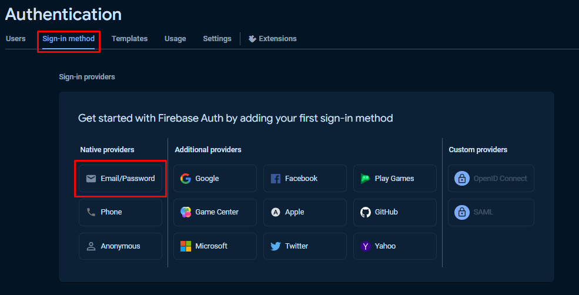
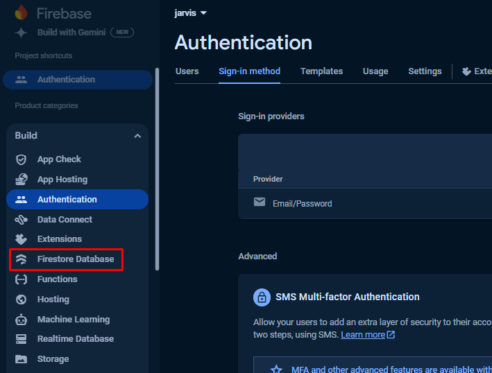
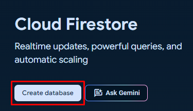
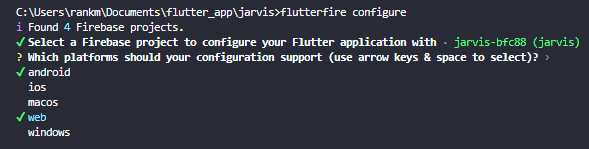

# Setup firebase for flutter fatest

1. You need paste your main like my [main.dart](https://)
2. Edit the script like the call package path and the home navigation
3. Get package to your project for [cloud_firestore](https://pub.dev/packages/cloud_firestore), [firebase_core](https://pub.dev/packages/firebase_core)
4. ⚠ Make sure youre already install node js, if you didn't installed yet. install now because its need for configutation call the data
5. After you install the node js, now lets make a new database on firebase goto [firebase console](https://console.firebase.google.com/)
6. Login into the firebase console if you didn't logged
7. Klik on create a project
   
8. In this tutorials i set the name is jarvis, klik next until the database created
   
9. Goto menu (Build) then click Authentication
   
10. Then click get started
    
11. Next click in sign in method, choose email/password
    
12. Click enable options on top, then save
    
13. Goto menu (Build) and click Firestore Database
    
14. Then klik create database
    
15. Choose the server location in this tutorial i choose this, then click next
    
16. Just click create on there
    
17. Then still in menu Firestore Database goto rules > change false to true > click publish
    
18. Now goto your IDE goto the terminal on your project paste this and enter wait until complete

```bash
npm install -g firebase-tools
```

19. Now paste this and enter, if youre not logged just login into the opened tab and login your account

```bash
firebase login
```

20. Now paste this and enter again, wait until complete

```bash
flutter pub global activate flutterfire_cli
```

21. ⚠ If youre using mac or ios you need to export the path, paste this and enter

```bash
export PATH="$PATH":"$HOME/.pub-cache/bin"
```

22. Paste this to configure the database we want use in flutter

```bash
flutterfire configure
```

23. Choose the database we already created before
    

24. Now choose youre want build you project to what ? in this case i need android and web i turned off i dont use (press space to remvoe checklist). Press enter and waiting the data process
    

25. After complete dont forget to call your package cloud_firestore and firebase_core on your main.dart
    

Thats the tutorial how to setup firebase to connect flutter project fastest i can, if i found a new method i will share on repo again. Thats it Happy Coding 😁👍
